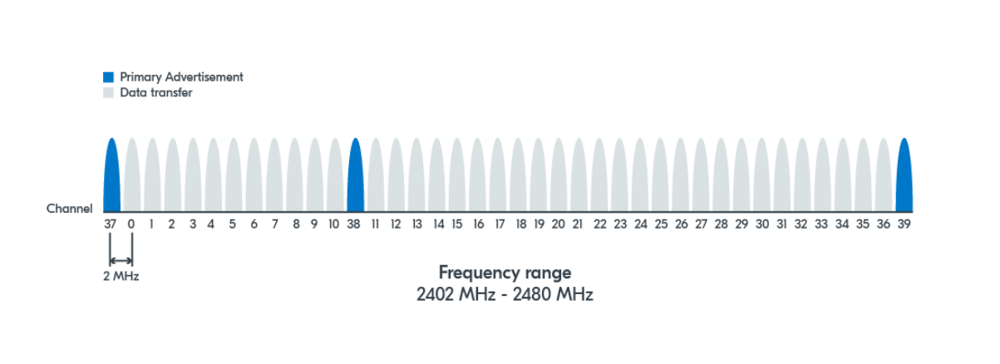

<!--
This includes your top-level README as you index page i.e. homepage.

This will not be the best approach for all exemplars, so feel free to customise
your index page as you see fit.
-->



<!-- Add more files in the `docs/` directory for them to be automatically
included in the Mkdocs documentation -->
# BLE Advertising and Scanning: What You Need to Know
This guide is all about getting you up to speed on the core concepts of BLE (Bluetooth Low Energy) advertising and scanning. This introduction is based on Lesson 2 of Nordic's excellent [BLE Fundamentals](https://academy.nordicsemi.com/courses/bluetooth-low-energy-fundamentals/) tutorial. If you've got some time and want to dive deeper into the underlying theory, we highly recommend checking out their full tutorial. But if you're short on time and just need the essentials to get going, you can simply breeze through this document—it'll give you a solid foundation!  

**A Note on Device Roles**  
    Throughout the Nordic course above, you'll notice us using different terms for devices, sometimes "scanner" and "advertiser," and other times "central" and "peripheral." This can be a bit confusing, but it reflects the different roles devices play during the Bluetooth Low Energy (BLE) communication process.   
    Here's why:  
    Discovery Phase: In the initial discovery phase, a device actively sending out broadcast packets is called an "advertiser." A device listening for these advertisements is a "scanner." The scanner's goal here is often to find advertisers it wants to connect with.  
    Connection Phase: If a scanner decides to initiate a connection with an advertiser, and that connection is successful, their roles evolve:  
    The scanner transitions into a "central" device.  
    The advertiser becomes a "peripheral" device.  
    So, while "scanner" and "advertiser" describe roles during the discovery and advertising process, "central" and "peripheral" describe their roles once a connection has been established. Throughout this document, we'll consistently use the terms "scanner" and "advertiser" when discussing device roles.

## Advertising and Discovery
### Channels
Bluetooth LE devices communicate through 40 different frequency channels. `Channel 37`, `Channel 38`, `Channel 39` are mainly used for advertisement purposes. Other channels are mainly used for data transfer after establishing a connection.

### Advertising and Discovery Process
**Definition of Terms**
* **Advertising intervals**: The interval at which an advertising packet is sent. This can range from 20 ms to 10.24 s, with a step increase of 0.625 ms.

* **Scan interval:** The interval at which a device scans for advertisement packets.
* **Scan window:** The time that a device spends scanning for packets at each scan interval.  
Both scan interval and scan window range from 2.5 ms to 10.24 seconds with a step increase of 0.625 ms.  

**Process**  
Since BLE operates in the crowded industrial, scientific, and medical radio band (ISM band), it has to share the airwaves with other technologies like Wi-Fi. This means there's always a risk of interference. On top of that, if two BLE devices try to send a signal on the same channel at the exact same time, they'll interfere with each other, making it hard for either message to get through.  
To increase the chances that advertising packets will be received by other devices, BLE has a clever trick: it sends the same advertisement packet sequentially across all three primary advertising channels (channels 37, 38, and 39).   
Simultaneously, a scanning device will scan these three channels to look for advertising devices. This redundancy significantly increases the likelihood that at least one of those packets will get through cleanly and be picked up by a scanning device.

### Advertising Types
* **Connectable vs. Non-Connectable**: 

    Determines whether the scanner can connect to the advertiser or not.  
    To help us visualize the process, we'll refer to a power analysis graph from Nordic Semiconductor's [online power profiler](https://devzone.nordicsemi.com/power/w/opp/2/online-power-profiler-for-bluetooth-le) — it's a great way to understand the energy consumption and timing of different advertising types.   
    * Connectable:
        The graph can be used to illustrate a connectable advertising event. You'll observe a repeating pattern: the device shows a distinct, dark green peak, indicating the transmission (TX) of an advertisement packet. Immediately following each TX peak, there's a short period represented by a lighter green segment, which indicates the receive (RX) mode. This RX window is crucial as the device is listening for any incoming connection requests. This TX-then-RX sequence repeats for each of the three primary advertising channels (37, 38, and 39), although the graph itself may not explicitly label the individual channel numbers on the timeline. 
        
    * Non-Connectable:  
        If we set the role to "Advertising (TX only)", the graph will exclusively show the TX (dark green) power consumption, with no associated RX (light green) activity. This clearly illustrates how a device solely focused on transmitting advertisements consumes power, without the added energy expenditure of listening for responses.
        

* **Scannable vs. Non-Scannable**:   
    Determines if the advertiser accepts scan requests from a scanner  
    In our exemplar, we won't be covering scan requests.  
    - *Scan request and response:*  
        During the discovery phase, if the scanner needs more information, it can send a scan request to the advertiser.  
        If the advertiser receives and accepts this scan request, it will reply with a scan response broadcast packet. These scan response packets are also sent over the advertising channels. It's worth noting that a scan response can sometimes be an empty broadcast packet.  
        This process allows the scanner to get additional information from the advertiser without needing to establish a full connection.    
        When an advertiser sends out scannable advertisements, it briefly opens its receiver (RX) on that same channel to listen for any scan requests from nearby devices. For example, after sending a packet on `channel 37`, it listens on `channel 37`; then after sending on `channel 38`, it listens on `channel 38`, and so on.    
        This allows it to listen for any scan requests from nearby devices. If it receives and accepts a scan request, it will then send a scan response.  

* **Directed vs. undirected**:  
    Determines whether advertisement packets are targeted to a specific scanner or not.  
    In this exemplar, we will focus solely on undirected advertising. While Bluetooth Low Energy (BLE) also supports directed advertising (where an advertiser specifically targets a known device), our examples and discussions will not cover this type of broadcast.
### Advertisement Packet
BLE advertisement packets are made up of several parts, but for a quick start guide like this, we'll focus on the most important one for getting your message out: the payload.  

Generally, the payload of a BLE advertisement packet consists of two main parts: a 6-byte address and up to 31 bytes of advertising data (`AdvData`). The `AdvData` is specifically where you'll place the information you want to broadcast.  
* **Advertisement Data Structures**:  
    The Advertising Data portion of the advertisement packet isn't just a raw block of bytes; it's organized into multiple, smaller units called Advertisement Data Structures (AD Structures).  
    Each AD structure is self-contained and follows a specific format:  
    * Length Field: This field indicates the total length of that particular AD structure (including the Length, AD Type, and AD Data fields themselves).  
    * AD Type Field: This field specifies the type of data contained within this AD structure. For example, it could indicate that the following data represents a device's local name, a UUID, or manufacturer-specific data. Note that the most common AD type is 1 byte long.  
    * AD Data Field: This is where the actual information corresponding to the AD Type is placed.

* **Commonly used AD structures**
    * Complete local name (BT_DATA_NAME_COMPLETE): This is simply the device name, that the human user sees when scanning for nearby devices (via a smartphone, for instance).  
    * Shortened local name (BT_DATA_NAME_SHORTENED): A shorter version of the complete local name.  
    * Uniform Resource Identifier (BT_DATA_URI): Used to advertise a URI like website addresses (URLs).
    * Service UUID: The Service Universally Unique Identifier is a number universally unique to a specific service. It can help scanners identify devices that are interesting to connect to. Different options are available here.
    * **Manufacturer Specific Data (BT_DATA_MANUFACTURER_DATA)**: This is a popular type that enables companies to define their own custom advertising data.
    * Flags: 1-bit variables that can flag a certain property or operational mode of that device. While up to 8 flags can be set, we'll focus on a few commonly used ones:
        * BT_LE_AD_LIMITED: Sets LE Limited Discoverable Mode, used with connectable advertising to indicate to a central that the device is only available for a certain amount of time before the advertising times out.  
        * BT_LE_AD_GENERAL: Indicates that the device is in LE General Discoverable Mode, meaning it's available for connection over a long period (effectively, no timeout).       
        * BT_LE_AD_NO_BREDR: Specifies that the device does not support Classic Bluetooth (BR/EDR), only Bluetooth Low Energy (BLE).  