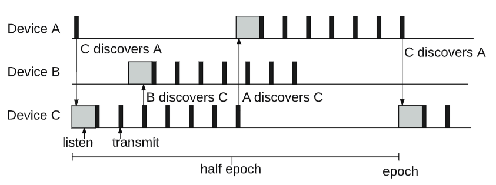

#  What is BLEnd? Theoretical Foundations

> **Note:** If you're completely new to BLE, please first read the document [BLE Advertising and Scanning: What You Need to Know](BLE_background_1.md) to ensure a clear understanding of the BLE scanning, advertising, and discovery process.


In many common Bluetooth Low Energy (BLE) applications, a simple client-server model works perfectly well for device discovery. Typically, one device acts as a scanner (which becomes the Central after connection), while another device acts as an advertiser (becoming the Peripheral). This leads to a unidirectional discovery process, where the Central actively searches for Peripherals. A classic example is a phone scanning for a smart device advertising its presence; once found, a connection is established, and application-specific interactions follow.

However, the BLEnd (Practical Continuous Neighbor Discovery for Bluetooth Low Energy) protocol deviates from this simpler "one device scans, one device advertises" setup. Instead, BLEnd is designed to manage the switching between advertising and scanning on all participating devices. This allows for a more dynamic and flexible discovery mechanism.

This sophisticated approach makes BLEnd particularly well-suited for scenarios that lack a fixed master-slave hierarchy. Its primary application lies in environments such as Decentralized Peer-to-Peer Networks and Ad-Hoc Group Formation, where every device needs to be equally capable of **finding** and **being found** by others, fostering neighbor discovery without a predetermined central authority.

## 📄 Related Publication

> **Title**: BLEnd: Practical Continuous Neighbor Discovery for Bluetooth Low Energy  
> **Authors**: Julien, Christine and Liu, Chenguang and Murphy, Amy L and Picco, Gian Pietro    
> **Published in**: IPSN '17: The 16th International Conference on Information Processing in Sensor Networks  
> **URL**: [BLEnd: Practical Continuous Neighbor Discovery for Bluetooth Low Energy] no link first

If you use BLEnd in your work, please cite:

```bibtex
@inproceedings{julien2017blend,
  title={BLEnd: practical continuous neighbor discovery for Bluetooth low energy},
  author={Julien, Christine and Liu, Chenguang and Murphy, Amy L and Picco, Gian Pietro},
  booktitle={Proceedings of the 16th ACM/IEEE International Conference on Information Processing in Sensor Networks},
  pages={105--116},
  year={2017},
  organization={ACM}
}
```
### 💻 Source Code
> The original BLEnd source code is hosted on GitHub: [BLEnd_Nordic](https://github.com/UT-MPC/BLEnd_Nordic.git)

## 📖 BLEnd Protocol Overview
BLEnd segmente time into discrete units called epochs. Within each epoch, devices switch between advertising and scanning roles. This rapid interleaving of activities enables all participating devices to both announce their presence and discover their neighbors efficiently.  

The paper proposes three distinct algorithms for neighbor discovery:
- Uni-directional Discovery (U-BLEnd) features a small duty cycle for low power consumption, with devices active for only just over half of each epoch, but it only guarantees uni-directional discovery.   
- Full-epoch Bi-directional Discovery (F-BLEnd) keeps devices active throughout the entire epoch, utilizing a larger duty cycle to guarantee reliable bi-directional discovery.   
- Efficient Bi-directional Discovery (B-BLEnd) builds upon U-BLEnd by dynamically adjusting its parameters to achieve efficient bi-directional discovery.

Furthermore, the original paper offers detailed methods to calculate the ideal epoch length (E) and advertising interval (A). These calculations are tailored to specific application scenarios, taking into account crucial factors like:

- Device density: How many BLE devices are expected to be in close proximity?
- Power consumption requirements: How critical is battery life for the devices?
- Latency requirements: How quickly do devices need to discover each other?

While the specifics of these optimization algorithms are complex and beyond the scope of this discussion, it's important to understand that epoch length (`E`) and advertising interval (`A`) are quantifiable parameters that can be derived using the proposed methods.

We'll focus on U-BLEnd, as it provides the foundational understanding for BLEnd's approach to discovery. For those interested in the more optimized B-BLEnd, please refer to the original paper.

### U-BLEnd
Within the U-BLEnd protocol, a device's operational cycle is structured into repeating epochs. As depicted in Figure 1, for the initial half of each epoch, the device actively engages its BLE radio for discovery. It first scans for a period, then transitions to advertising. During the latter half of the epoch, the radio transitions to a low-power stand-by state, conserving energy. 

Drawing from the optimization algorithms mentioned earlier, we can determine the system's required epoch length (`E`) and advertising interval (`A`). The scan duration is critically dependent on the advertising interval (`A`) to ensure reliable beacon reception. Since BLE broadcasts have a non-negligible duration (let's denote the beacon duration as `b`), a listener might only receive a partial beacon if its scan window isn't long enough. To counter this, the scan duration must be at least `A+b`. Furthermore, because BLE introduces a random slack to the application-specified advertising interval to avoid persistent collisions, the scan duration needs to be extended to account for this variability. Therefore, the scan window duration must be at least `A+b+s`, where `s` represents the maximum random slack added.

To ensure reliable neighbor detection, the active portion of the epoch, defined as the time from the beginning of scanning to the end of the last beacon, is greater than half of the epoch. This design guarantees a temporal overlap in the active phases of independent devices, resulting in detection. It may also result in bi-directional discovery, as shown in Figure 1 for `Device A` and `Device C`.

    
  **Figure 1: U-BLEnd Epoch Structure.**
