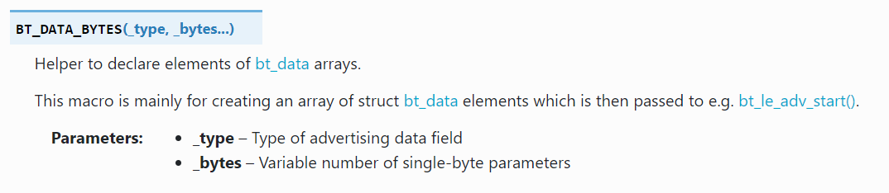

<!--
This includes your top-level README as you index page i.e. homepage.

This will not be the best approach for all exemplars, so feel free to customise
your index page as you see fit.
-->



<!-- Add more files in the `docs/` directory for them to be automatically
included in the Mkdocs documentation -->
# Introduction to Zephyr API: Generic Access Profile (GAP)
In Zephyr OS, the `zephyr/bluetooth/gap.h` header file provides the essential APIs applications need to interact with the **Bluetooth Generic Access Profile (GAP)**. GAP defines how Bluetooth devices discover each other, connect, and communicate in a secure manner. Understanding this header is crucial for developing any Zephyr-based Bluetooth application.

---

## Core Concepts

* **Roles**: Bluetooth GAP defines various roles a device can assume, primarily including:
    * **Broadcaster**: A device that only sends advertising data (e.g., a beacon).
    * **Observer**: A device that only scans for advertising data.
    * **Central**: A device that scans for and connects to peripheral devices (e.g., a smartphone connecting to Bluetooth headphones).
    * **Peripheral**: A device that can be connected to by a central device (e.g., Bluetooth headphones).
    
* **Operations & Device Interactions**
    * **Advertising & Scanning**:
        * **Advertising**: Advertising: Devices transmit advertising packets containing information like their name and service UUIDs, making themselves discoverable. This is typically performed by **Peripheral** and **Broadcaster** roles.
        * **Scanning**: Devices listen for and parse advertising packets sent by other devices. This is a primary action for **Central** and **Observer** roles.
    * **Connection**: Once devices discover each other and aim to communicate, they establish and manage a connection. GAP handles the lifecycle of these connections. This primarily involves **Central** and **Peripheral** roles.
    <!-- 
        * **Pairing & Bonding**:
            * **Pairing**: The process of establishing shared secret keys for secure communication.
            * **Bonding**: Persisting the keys generated during pairing so that future secure connections can be established without re-pairing.
    -->
* **Address Types**: Bluetooth devices use addresses to uniquely identify themselves. Common address types include:
    * **Public Address**: A globally unique IEEE EUI-48 address. It's predominantly associated with Classic Bluetooth, also known as BR/EDR (Basic Rate/Enhanced Data Rate) connections.
    * **Random Address**: Widely used in Bluetooth Low Energy (BLE) 
    <!-- , random addresses can be:
        * **Static Random Address**: Persists across device resets but differs from a public address.
        * **Resolvable Private Address (RPA)**: A dynamic, frequently changing address that enhances privacy. It can be resolved to a device's real identity using a pre-shared Identity Resolving Key (IRK), making devices harder to track.
        * **Non-Resolvable Private Address (NRPA)**: A randomly generated address that offers no resolution mechanism, ideal for scenarios where no tracking is desired.
    -->

---

## Key API Functions (from `zephyr/bluetooth/gap.h` and related)

While `zephyr/bluetooth/gap.h` itself exposes a limited number of direct APIs, it defines structures and macros relevant to GAP. Actual GAP operations are often performed by combining APIs from `bluetooth/bluetooth.h` and implicitly using definitions from `bluetooth/gap.h`.  
**Usful links**:  
Nordic: https://docs.nordicsemi.com/bundle/zephyr-apis-latest/page/group_bt_gap.html  
Zephyr: https://docs.zephyrproject.org/apidoc/latest/group__bt__gap.html

Here are some common GAP-related operations you'll frequently encounter in Zephyr Bluetooth development:  
### 1. Initializing the Bluetooth Stack

```c
int bt_enable	(	bt_ready_cb_t	cb	)	
```
The bt_enable() function is the essential starting point for any Bluetooth application in Zephyr. You must call this function before attempting any other Bluetooth operations that require communication with the local Bluetooth hardware.
* **Parameters**  
**cb**:  
    Give it a **callback** function: Your program continues running, and Zephyr tells that function when Bluetooth is ready. This is what we call asynchronous operation – tasks happening in the background without blocking your main program flow.  
    Give it **NULL**: Your program pauses and waits until Bluetooth is ready before moving on. This is a synchronous operation. 

* **Returns**
Zero on success or (negative) error code otherwise.
* **Example**
    ```ini
    # in prj.conf file
    # Logger module
    CONFIG_LOG=y
    #  Include the Bluetooth LE stack in your project
    CONFIG_BT=y
    ```
    ```c
    # in .c file
    #include <zephyr/bluetooth/bluetooth.h>
    #include <zephyr/bluetooth/gap.h> 
    int err;

        /* Enable the Bluetooth LE stack */
        err = bt_enable(NULL);
        if (err) {
            LOG_ERR("Bluetooth init failed (err %d)\n", err);
            return; // Handle error appropriately
        }

        LOG_INF("Bluetooth initialized\n");
    ```	
### 2. Configuring Advertisement
The functions described below are central to implementing Bluetooth Low Energy (BLE) advertising in your applications. Before diving into their specifics, we strongly recommend you first read our [BLE Advertising and Scanning: What You Need to Know](BLE_background_1.md) document. This will give you the essential foundational knowledge of how BLE advertising works, which is crucial for understanding these functions.

#### **Related Structures**  
- **struct bt_le_adv_param**: specifies what fields (variables) are needed to describe Bluetooth Low Energy (LE) advertising parameters.
    We can use the helper maco BT_LE_ADV_PARAM() to initialize an instance of the bt_le_adv_param structure:
    
    - **Advertising options**: 
        Specific macros to configure the advertising options. These options are a set of configuration bits that control the behavior of the advertising process.
        For example:
        - BT_LE_ADV_OPT_NONE: 	simply means "don't auto-configure any behavior" — but it doesn't prevent you from manually adding things like the name.
        - BT_LE_ADV_OPT_CONNECTABLE: lets other devices connect to you.
        - BT_LE_ADV_OPT_USE_NAME: includes the device name in the advertising data.
    - **Advertising interval**:
        - **Minimum advertising interval**:  is calculated as N×0.625 milliseconds and must be less than or equal to the maximum advertising interval.
        - **Maximum advertising interval**:   is also calculated as N×0.625 milliseconds and must be greater than or equal to the minimum advertising interval.   
        - For both the minimum and maximum intervals, the value of N must fall between 32 and 16384. This means the advertising interval can range from 20 milliseconds to 10.24 seconds. The API provides convenient, ready-to-use options, rather than forcing you to always manually calculate and input the raw numerical value of 'N'.
        - the actual advertising interval used by the Bluetooth Low Energy (BLE) device will be a random value chosen by the BLE controller within that specified range (Min to Max), plus a small random delay. Some advanced BLE stacks or applications might even dynamically adjust the advertising interval within the min/max range.  
    - **Peer address**: Included if directed advertising is used. Otherwise, set to NULL.   
- **struct bt_data**:Description of different data types that can be encoded into advertising data. 
    - Populate the flags using the helper macro **BT_DATA_BYTES()**.
          
        The Flags byte is a bitmask, meaning each bit represents a distinct piece of information. To set multiple flags, you combine their individual bit values using the bitwise OR operator (|).  
        Example:
        ```c
        #include <zephyr/bluetooth/bluetooth.h>
        #include <zephyr/bluetooth/gap.h>
        /* Set the advertising flags */
	    BT_DATA_BYTES(BT_DATA_FLAGS, BT_LE_AD_NO_BREDR|BT_LE_AD_GENERAL), // no BR/EDR support , General Discoverable
        ```
    - Set the advertising packet data using the helper macro BT_DATA()
          
        -  Declare the Manufacturer Specific Data:  
            Manufacturer Specific Data is used to create and include custom data in Bluetooth LE advertising. The data to be included can be in any format suitable for your use case/application.   
            The first two bytes in the Manufacturer Specific Data are the company identifier as registered in Bluetooth SIG in the Assigned Numbers Document. For educational/testing purposes, we will use Nordic Semiconductor Company Identifier.  
    - Example:
        ```c
        /* Declare the Company identifier (Company ID) */
        #define COMPANY_ID_CODE 0x0059      // Nordic Semiconductor Company Identifier.

        typedef struct adv_mfg_data {
	        uint16_t company_code; /* Company Identifier Code. */
	        uint16_t custom_data; /* custom data */
        } adv_mfg_data_type;

        /* Define and initialize a variable of type adv_mfg_data_type */
        static adv_mfg_data_type adv_mfg_data = { COMPANY_ID_CODE, 0x0000 };

        /* Declare the advertising packet */
        static const struct bt_data ad[] = {
	    /* Set the advertising flags */
	    BT_DATA_BYTES(BT_DATA_FLAGS, BT_LE_AD_NO_BREDR), // no BR/EDR support
	    /* Set the advertising packet data:  manufacturer data */
	    BT_DATA(BT_DATA_MANUFACTURER_DATA, (unsigned char *)&adv_mfg_data, sizeof(adv_mfg_data)),   
        };
        ```
#### **Functions**
- **bt_le_adv_start**:  
    In Zephyr, once your Bluetooth stack is initialized (with bt_enable()), the bt_le_adv_start() function is your primary tool for making your device discoverable to others using Bluetooth Low Energy (LE) advertising. This function sets advertisement parameters, advertisement data, scan response data and start advertising.  
    ```c
    int bt_le_adv_start	(	const struct bt_le_adv_param *	param,
                        const struct bt_data *	ad,     //Data to be used in advertisement packets.
                        size_t	ad_len,                 //Number of elements in ad
                        const struct bt_data *	sd,     //Data to be used in scan response packets.
                        size_t	sd_len )                //Number of elements in sd
    ```
    - **size_t	ad_len or sd_len**:  
        In programming APIs for BLE, you often define your advertising data as an array or list of these individual AD elements. The "number of elements in ad" would then be the size of that array/list.  
        An advertising packet might contain:  
            Element 1: Flags (BT_LE_AD_NO_BREDR)  
            Element 2: Complete Local Name ("My Sensor Device")  
            Element 3: List of 16-bit Service UUIDs (e.g., for a Heart Rate Service)  
    - **Returns** 
        Zero on success or (negative) error code otherwise.
    - Example()
        ```c
        /*
        * This example snippet demonstrates BLE advertising setup.
        * It relies on standard Bluetooth LE API definitions (e.g., from `bluetooth/bluetooth.h`
        * and `bluetooth/gap.h`) and associated structure definitions (e.g., `struct bt_le_adv_param`,
        * `struct bt_data`) that would typically be found in your project's header files.
        */
        int err;
        // adv date: ad, no scan response data
        err = bt_le_adv_start(adv_param, ad, ARRAY_SIZE(ad), NULL, 0);
        if (err) {
            LOG_ERR("Advertising failed to start (err %d)", err);
        } else {
        LOG_INF("Advertising started (%d times)", broadcast_count + 1);
        }
        ```
- **bt_le_adv_stop**: 
    Stop advertising.  
    - **Returns**:
        Zero on success or (negative) error code otherwise.  
        In major Bluetooth stacks like Zephyr's, functions for stopping advertising are safe to call even if no advertising is currently active.
- **bt_le_adv_update_data**:   
    Dynamically update the content of your advertising and/or scan response packets while the device is already actively advertising.
     ```c
    int bt_le_adv_update_data(const struct bt_data *ad, size_t ad_len,
			  const struct bt_data *sd, size_t sd_len)
    ```  
    It doesn't typically stop the current advertising interval and immediately restart; instead, the change takes effect for the next scheduled advertisement.  
    You generally cannot update advertising data using bt_le_adv_update_data() if the advertising is currently stopped.
   