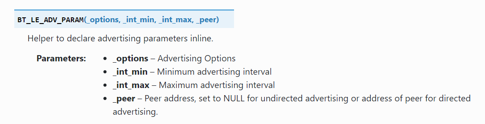
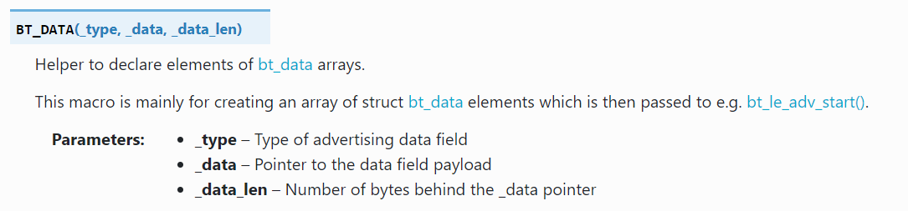

<!--
This includes your top-level README as you index page i.e. homepage.

This will not be the best approach for all exemplars, so feel free to customise
your index page as you see fit.
-->



<!-- Add more files in the `docs/` directory for them to be automatically
included in the Mkdocs documentation -->
# Introduction to Zephyr API: Generic Access Profile (GAP)
In Zephyr OS, the `zephyr/bluetooth/gap.h` header file provides the essential APIs applications need to interact with the **Bluetooth Generic Access Profile (GAP)**. GAP defines how Bluetooth devices discover each other, connect, and communicate in a secure manner. Understanding this header is crucial for developing any Zephyr-based Bluetooth application.

---

## Core Concepts

* **Roles**: Bluetooth GAP defines various roles a device can assume, primarily including:
    * **Broadcaster**: A device that only sends advertising data (e.g., a beacon).
    * **Observer**: A device that only scans for advertising data.
    * **Central**: A device that scans for and connects to peripheral devices (e.g., a smartphone connecting to Bluetooth headphones).
    * **Peripheral**: A device that can be connected to by a central device (e.g., Bluetooth headphones).
    
* **Operations & Device Interactions**
    * **Advertising & Scanning**:
        * **Advertising**: Devices transmit advertising packets containing information like their name and service UUID(Universally Unique Identifier), making themselves discoverable. This is typically performed by **Peripheral** and **Broadcaster** roles.
        * **Scanning**: Devices listen for and parse advertising packets sent by other devices. This is a primary action for **Central** and **Observer** roles.
    * **Connection**: Once devices discover each other and aim to communicate, they establish and manage a connection. GAP handles the lifecycle of these connections. This primarily involves **Central** and **Peripheral** roles.
    <!-- 
        * **Pairing & Bonding**:
            * **Pairing**: The process of establishing shared secret keys for secure communication.
            * **Bonding**: Persisting the keys generated during pairing so that future secure connections can be established without re-pairing.
    -->
* **Address Types**: Bluetooth devices use addresses to uniquely identify themselves. Common address types include:
    * **Public Address**: A globally unique IEEE EUI-48 address. It's predominantly associated with Classic Bluetooth, also known as BR/EDR (Basic Rate/Enhanced Data Rate) connections.
    * **Random Address**: Widely used in Bluetooth Low Energy (BLE) 
    <!-- , random addresses can be:
        * **Static Random Address**: Persists across device resets but differs from a public address.
        * **Resolvable Private Address (RPA)**: A dynamic, frequently changing address that enhances privacy. It can be resolved to a device's real identity using a pre-shared Identity Resolving Key (IRK), making devices harder to track.
        * **Non-Resolvable Private Address (NRPA)**: A randomly generated address that offers no resolution mechanism, ideal for scenarios where no tracking is desired.
    -->

---

## Key API Functions (from `zephyr/bluetooth/gap.h` and related)
 While `zephyr/bluetooth/gap.h` serves as the foundational header for the GAP, defining its core structures, roles, and macros, the functional APIs for specific GAP operations. Actual GAP operations are often performed by combining APIs from `bluetooth/bluetooth.h` and are often modularized into dedicated headers. For instance, `scan.h` provides functions for device discovery, and `conn.h` handles active connection management, both building upon the underlying GAP definitions established in gap.h.    
**Usful links**:  
Nordic: https://docs.nordicsemi.com/bundle/zephyr-apis-latest/page/group_bt_gap.html  
Zephyr: https://docs.zephyrproject.org/apidoc/latest/group__bt__gap.html

Here are some common GAP-related operations you'll frequently encounter in Zephyr Bluetooth development:  
### 1. Initializing the Bluetooth Stack

```c
int bt_enable	(	bt_ready_cb_t	cb	)	
```
The bt_enable() function is the essential starting point for any Bluetooth application in Zephyr. You must call this function before attempting any other Bluetooth operations that require communication with the local Bluetooth hardware.
* **Parameters**  
**cb**:  
    Give it a **callback** function: Your program continues running, and Zephyr tells that function when Bluetooth is ready. This is what we call asynchronous operation – tasks happening in the background without blocking your main program flow.  
    Give it **NULL**: Your program pauses and waits until Bluetooth is ready before moving on. This is a synchronous operation. 

* **Returns**
Zero on success or (negative) error code otherwise.
* **Example**
    ```ini
    # in prj.conf file
    # Logger module
    CONFIG_LOG=y
    #  Include the Bluetooth LE stack in your project
    CONFIG_BT=y
    ```
    ```c
    # in .c file
    #include <zephyr/bluetooth/bluetooth.h>
    #include <zephyr/bluetooth/gap.h> 
    int err;

        /* Enable the Bluetooth LE stack */
        err = bt_enable(NULL);
        if (err) {
            LOG_ERR("Bluetooth init failed (err %d)\n", err);
            return; // Handle error appropriately
        }

        LOG_INF("Bluetooth initialized\n");
    ```	
### 2. Configuring Advertisement
The functions described below are central to implementing BLE advertising in your applications. Before diving into their specifics, we strongly recommend you first read our [BLE Advertising and Scanning: What You Need to Know](BLE_background_1.md) document. This will give you the essential foundational knowledge of how BLE advertising works, which is crucial for understanding these functions.

#### **Related Structures**  
- **struct bt_le_adv_param**: specifies what fields (variables) are needed to describe Bluetooth Low Energy (LE) advertising parameters.
    We can use the helper maco BT_LE_ADV_PARAM() to initialize an instance of the bt_le_adv_param structure:
    
    - **Advertising options**: 
        Specific macros to configure the advertising options. These options are a set of configuration bits that control the behavior of the advertising process.
        For example:
        - BT_LE_ADV_OPT_NONE: 	simply means "don't auto-configure any behavior" — but it doesn't prevent you from manually adding things like the name.
        - BT_LE_ADV_OPT_CONNECTABLE: lets other devices connect to you.
        - BT_LE_ADV_OPT_USE_NAME: includes the device name in the advertising data.
    - **Advertising interval**:
        - **Minimum advertising interval**:  is calculated as N×0.625 milliseconds and must be less than or equal to the maximum advertising interval.
        - **Maximum advertising interval**:   is also calculated as N×0.625 milliseconds and must be greater than or equal to the minimum advertising interval.   
        - For both the minimum and maximum intervals, the value of N must fall between 32 and 16384. This means the advertising interval can range from 20 milliseconds to 10.24 seconds. The API provides convenient, ready-to-use options, rather than forcing you to always manually calculate and input the raw numerical value of 'N'.
        - the actual advertising interval used by the BLE device will be a random value chosen by the BLE controller within that specified range (Min to Max), plus a small random delay. Some advanced BLE stacks or applications might even dynamically adjust the advertising interval within the min/max range.  
    - **Peer address**: Included if directed advertising is used. Otherwise, set to NULL.   
- **struct bt_data**:Description of different data types that can be encoded into advertising data. 
    - Populate the flags using the helper macro **BT_DATA_BYTES()**.
          
        The Flags byte is a bitmask, meaning each bit represents a distinct piece of information. To set multiple flags, you combine their individual bit values using the bitwise OR operator (|).  
        Example:
        ```c
        #include <zephyr/bluetooth/bluetooth.h>
        #include <zephyr/bluetooth/gap.h>
        /* Set the advertising flags */
	    BT_DATA_BYTES(BT_DATA_FLAGS, BT_LE_AD_NO_BREDR|BT_LE_AD_GENERAL), // no BR/EDR support , General Discoverable
        ```
    - Set the advertising packet data using the helper macro BT_DATA()
          
        -  Declare the Manufacturer Specific Data:  
            Manufacturer Specific Data is used to create and include custom data in Bluetooth LE advertising. The data to be included can be in any format suitable for your use case/application.   
            The first two bytes in the Manufacturer Specific Data are the company identifier as registered in Bluetooth SIG in the Assigned Numbers Document. For educational/testing purposes, we will use Nordic Semiconductor Company Identifier.  
    - Example:
        ```c
        /* Declare the Company identifier (Company ID) */
        #define COMPANY_ID_CODE 0x0059      // Nordic Semiconductor Company Identifier.

        typedef struct adv_mfg_data {
	        uint16_t company_code; /* Company Identifier Code. */
	        uint16_t custom_data; /* custom data */
        } adv_mfg_data_type;

        /* Define and initialize a variable of type adv_mfg_data_type */
        static adv_mfg_data_type adv_mfg_data = { COMPANY_ID_CODE, 0x0000 };

        /* Declare the advertising packet */
        static const struct bt_data ad[] = {
	    /* Set the advertising flags */
	    BT_DATA_BYTES(BT_DATA_FLAGS, BT_LE_AD_NO_BREDR), // no BR/EDR support
	    /* Set the advertising packet data:  manufacturer data */
	    BT_DATA(BT_DATA_MANUFACTURER_DATA, (unsigned char *)&adv_mfg_data, sizeof(adv_mfg_data)),   
        };
        ```
#### **Functions**
- **bt_le_adv_start**:  
    In Zephyr, once your Bluetooth stack is initialized (with bt_enable()), the bt_le_adv_start() function is your primary tool for making your device discoverable to others using Bluetooth Low Energy (LE) advertising. This function sets advertisement parameters, advertisement data, scan response data and start advertising.  
    ```c
    int bt_le_adv_start	(	const struct bt_le_adv_param *	param,
                        const struct bt_data *	ad,     //Data to be used in advertisement packets.
                        size_t	ad_len,                 //Number of elements in ad
                        const struct bt_data *	sd,     //Data to be used in scan response packets.
                        size_t	sd_len )                //Number of elements in sd
    ```
    - `size_t	ad_len or sd_len`:  
        In programming APIs for BLE, you often define your advertising data as an array or list of these individual AD elements. The "number of elements in ad" would then be the size of that array/list.  
        An advertising packet might contain:  
            Element 1: Flags (BT_LE_AD_NO_BREDR)  
            Element 2: Complete Local Name ("My Sensor Device")  
            Element 3: List of 16-bit Service UUIDs (e.g., for a Heart Rate Service)  
    - **Returns** 
        Zero on success or (negative) error code otherwise.
    - Example()
        ```c
        /*
        * This example snippet demonstrates BLE advertising setup.
        * It relies on standard Bluetooth LE API definitions (e.g., from `bluetooth/bluetooth.h`
        * and `bluetooth/gap.h`) and associated structure definitions (e.g., `struct bt_le_adv_param`,
        * `struct bt_data`) that would typically be found in your project's header files.
        */
        int err;
        // adv date: ad, no scan response data
        err = bt_le_adv_start(adv_param, ad, ARRAY_SIZE(ad), NULL, 0);
        if (err) {
            LOG_ERR("Advertising failed to start (err %d)", err);
        } else {
        LOG_INF("Advertising started (%d times)", broadcast_count + 1);
        }
        ```
- **bt_le_adv_stop**: 
    Stop advertising.  
    - **Returns**:
        Zero on success or (negative) error code otherwise.  
        In major Bluetooth stacks like Zephyr's, functions for stopping advertising are safe to call even if no advertising is currently active.
- **bt_le_adv_update_data**:   
    Dynamically update the content of your advertising and/or scan response packets while the device is already actively advertising.
     ```c
    int bt_le_adv_update_data(const struct bt_data *ad, size_t ad_len,
			  const struct bt_data *sd, size_t sd_len)
    ```  
    It doesn't typically stop the current advertising interval and immediately restart; instead, the change takes effect for the next scheduled advertisement.  
    You generally cannot update advertising data using bt_le_adv_update_data() if the advertising is currently stopped.
### 3. Scanner module
While the GAP in BLE defines the core roles and procedures for device discovery and connection establishment—including both advertising and scanning concepts—the practical software implementation often encapsulates scanning functionality within a dedicated module. This design promotes modularity and better code organization.

Consequently, when developing applications that involve scanning, you'll need to include specific headers for the scanning module in addition to the general GAP headers. For instance, in environments like Zephyr or Nordic Connect SDK, you'd include:
```c
    #include <zephyr/bluetooth/gap.h>
    #include <bluetooth/scan.h>
```
Here, `<zephyr/bluetooth/gap.h>` provides general GAP-related definitions and APIs, while `<bluetooth/scan.h>` specifically offers functions and structures for configuring and executing BLE scan operations. You can find detailed information about the scanner module in its official documentation: [Nordic_Scanner_module](https://docs.nordicsemi.com/bundle/ncs-1.1.0/page/nrf/include/bluetooth/scan.html).
#### **Initialization and Configuration**
This step covers functions essential for setting up the scanner and defining its fundamental operational parameters. This is where you prepare the scanning mechanism before it becomes active.
- **bt_scan_init**   
    This function initializes the BLE Scanning Module. Proper initialization ensures the module is ready to execute scan operations and handle subsequent connection attempts based on the provided configuration.
    ```c
    void bt_scan_init(const struct bt_scan_init_param *init);
    ```
    - **Parameters:**
        - `const struct bt_scan_init_param *init` 
              
- **bt_scan_cb_register**   
    This function registers a set of callbacks that allow your application to monitor and react to various events occurring during the BLE scanning process. By registering these callbacks, your application gains visibility into when scan filters are matched, when no devices are found for a filter, or when connection attempts fail after a scan.
    ```C
    void bt_scan_cb_register(struct bt_scan_cb *cb);
    ```
    - **Parameters:**
        - ``struct bt_scan_cb *cb``  
            A pointer to a structure containing the function pointers for your application's scanning callbacks.   
            The `BT_SCAN_CB_INIT` macro is a convenient way to initialize a `struct bt_scan_cb` instance with your specific callback functions. It streamlines the process by setting up the structure with the provided function pointers.
                 
#### **Scan Filtering**   
Before starting the actual scan, you'll typically want to define what kind of advertisement packets you're interested in. Functions in this category allow you to add, remove, and manage filters, ensuring your application only processes relevant scan reports.
- **bt_scan_filter_add**   
    This function allows you to add a new filter to the BLE scanning module. By applying filters, your application can reduce the number of irrelevant advertisement reports it receives, thereby saving processing power and focusing on devices or services of interest.
    ```c
    int bt_scan_filter_add(enum bt_scan_filter_type type, const void *data);
    ```
    - **Parameters:**
        - `enum bt_scan_filter_type type` 
            Specifies the type of filter to be added. This enumeration defines the criteria for filtering, such as device address, advertising data (e.g., UUIDs, manufacturer data).
            - BT_SCAN_FILTER_TYPE_NAME: Filter for names.
            - BT_SCAN_FILTER_TYPE_SHORT_NAME: Filter for short names.
            - BT_SCAN_FILTER_TYPE_ADDR: Filter for addresses.
            - BT_SCAN_FILTER_TYPE_UUID: Filter for UUIDs.
            - BT_SCAN_FILTER_TYPE_APPEARANCE: Filter for appearances.
            - BT_SCAN_FILTER_TYPE_MANUFACTURER_DATA: Filter for manufacturer data.
        - `const void *data`
            A pointer to the specific data for the filter. The type and structure of this data depend on the type parameter.
    - **Return**  
        0 on success, or a negative error code if the operation failed (e.g., no available space for the filter or the filter already exists).
- **bt_scan_filter_enable**   
    This function enables configured scanning filters. It allows you to specify which types of filters should be active and how multiple enabled filters should be combined to determine a match. This provides fine-grained control over which advertisement reports are processed by your application.
    ```c
    int bt_scan_filter_enable(u8_t mode, bool match_all);
    ```
    - **Parameters:**
        - `u8_t mode`  
            A bitmask indicating which types of filters to enable. You can combine multiple filter types using the bitwise OR operator.
        - `bool match_all`  
            `true`: AND operation. A device must match all enabled filter types (mode) to be considered a match.  
            `false`: OR operation. A device will be considered a match if it matches any of the enabled filter types (mode). 
    - **Return**  
        0 If the operation was successful. Otherwise, a negative error code is returned.
- **bt_scan_filter_remove_all**  
    This function clears out all the specific filter data you previously added. All your saved addresses, UUIDs, etc., are gone from the module's memory.
    ```c
    void bt_scan_filter_remove_all(void);
    ```
    However, it does not change the state of the filtering mechanism itself. If you previously called `bt_scan_filter_enable` to turn the filtering on, it remains on.
#### **Scan Control**   
This step manages the active state of the scanner. This includes starting the scanning process or stopping it entirely.
- **bt_scan_start**   
    This function starts the scanning according to the configuration set during the initialization.
    ```c
    int bt_scan_start(enum bt_scan_type scan_type);
    ```
    - **Parameters:**
        - `enum bt_scan_type scan_type`  
            - `BT_SCAN_TYPE_SCAN_PASSIVE`: The scanner (Observer role) only listens for advertisement packets from other devices. It does not transmit any packets, such as scan requests. 
            - `BT_SCAN_TYPE_SCAN_ACTIVE`:  In active scanning, the scanner actively participates in the discovery process. When it receives an advertising packet from a scannable or connectable advertiser, it sends a Scan Request (SCAN_REQ) packet back to that advertiser.
    - **Return**  
        0 If the operation was successful. Otherwise, a negative error code is returned.
- **bt_scan_stop**  
    Function for stopping scanning.
    ```c
    int bt_scan_stop(void);
    ```
### 4. Connection
Upon receiving a connectable advertisement, the scanner can decide to send a connection request packet back to the advertiser. This packet contains information necessary for establishing the connection, such as the scanner's address and desired connection parameters. If the advertiser accepts the connection request, a direct, point-to-point connection is established between the two devices. This transition marks a significant shift from the broadcast-based advertising phase to a communication link. Once a connection is established, both the **Central** and the **Peripheral** device have the capability to disconnect from the link.   
            
Just as `scan.h` and `scan.c` form a scanner module, a separate `conn.h` and `conn.c` module is used to provide the core functions and definitions necessary for managing a BLE connection. You can find detailed information about the scanner module in its official documentation: [Connection Management](https://docs.zephyrproject.org/apidoc/latest/group__bt__conn.html)

```c
    #include <zephyr/bluetooth/conn.h>
```
#### Registering Connection Instance and Callback Functions
- **bt_conn:**
    This struct is a fundamental data structure within the BLE stack that uniquely represents and stores all essential information about a connection. it can be initially defined as NULL and then assigned a valid connection object when a connection is successfully established.
- **bt_conn_cb:**    
    This structure is used for tracking the state of a connection.     
    Data Fields:      
    - connected:   
        The connected callback function, part of the `bt_conn_cb` structure, is invoked by the BLE stack to notify the application when a new connection has been successfully established, providing the connection object (`conn`) and any error status (`err`).
        ```c
        void(* bt_conn_cb::connected) (struct bt_conn *conn, uint8_t err)
        ```
    - disconnected:   
        The disconnected callback function is called by the BLE stack to inform the application when an active connection has been terminated, providing the connection object and the specific reason for the disconnection.
        ```c
        void(* bt_conn_cb::disconnected) (struct bt_conn *conn, uint8_t reason)
        ```
    - The `bt_conn_cb` structure also can include function pointers to handle other crucial connection events, such as updates to connection parameters or changes in the connection's security level...
- **bt_conn_cb_register:**   
    This function registers a set of callbacks to monitor connection states, returning `0` on success or `-EEXIST` if the callbacks have already been registered.
    ```c
    int bt_conn_cb_register	(	struct bt_conn_cb *	cb	)	
    ```
#### Core Functions for Active BLE Connections  
- **bt_conn_ref:**  
    This function is used to increment the reference count of a given struct `bt_conn` object. In systems like BLE stacks, reference counting is a common memory management technique to ensure that an object is not deallocated (freed from memory) while other parts of the code are still using it.

    When you provide a connection object `conn` and call this function, you are telling the stack that you are now using this object and it should be kept alive. The function returns the connection object itself (with its incremented reference count) or NULL if the object's reference count was already zero.  
    - **Example:**
    ```c
    static struct bt_conn *current_conn = NULL;

    // The connected callback function
    static void on_connected(struct bt_conn *conn, uint8_t err)
    {
        //store connection object with its reference count  
        current_conn = bt_conn_ref(conn);
    }
    ```

- **bt_conn_get_info:**
    This function provides connection information and returns `0` on success or (negative) error code on failure.
    ```c
        int bt_conn_get_info	(	const struct bt_conn *	conn, struct bt_conn_info *	info )
    ```
    - **Parameters** 
        - `bt_conn *	conn`   
            Connection object.
        - `bt_conn_info *	info`    
            The struct `bt_conn_info` is a data structure used to provide detailed, read-only information about an active BLE connection, such as the Connection Role (Central or Peripheral), Security level and current Connection state, among other relevant parameters.   

#### Managing Disconnection in BLE  
- **bt_conn_unref:**  
     This function is used to decrement the reference count of a struct `bt_conn` object. For every `bt_conn_ref` call, there should typically be a corresponding `bt_conn_unref` call to decrement the reference count when you're done with the object. 
     ```c
     void bt_conn_unref	(	struct bt_conn *	conn	)	
     ```
    
- **bt_conn_disconnect:**
    This function disconnect an active connection with the specified reason code or cancel pending outgoing connection.
    ```c
    int bt_conn_disconnect	(	struct bt_conn *	conn,   uint8_t	reason )
    ```
    - **Parameters** 
        - `bt_conn *	conn`   
            Connection object.
        - `reason`      
            - `BT_HCI_ERR_REMOTE_USER_TERM_CONN`: The remote device intentionally disconnected (disconnect reason for a normal disconnect).
            - `BT_HCI_ERR_AUTH_FAIL`: Authentication failed.
            - `BT_HCI_ERR_REMOTE_LOW_RESOURCES`: Remote device disconnected due to insufficient resources.
            - `BT_HCI_ERR_REMOTE_POWER_OFF`: Remote device powered off or reset.
            - `BT_HCI_ERR_UNSUPP_REMOTE_FEATURE`: Remote device doesn't support a requested feature.
            - `BT_HCI_ERR_PAIRING_NOT_SUPPORTED`: Remote device doesn't support a requested feature.
            - `BT_HCI_ERR_UNACCEPT_CONN_PARAM`: Remote device rejected proposed connection parameters.

