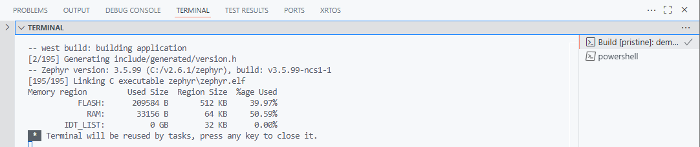
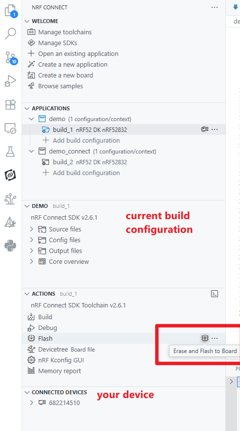
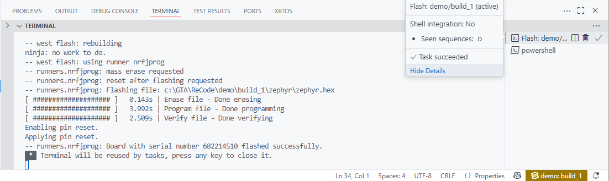
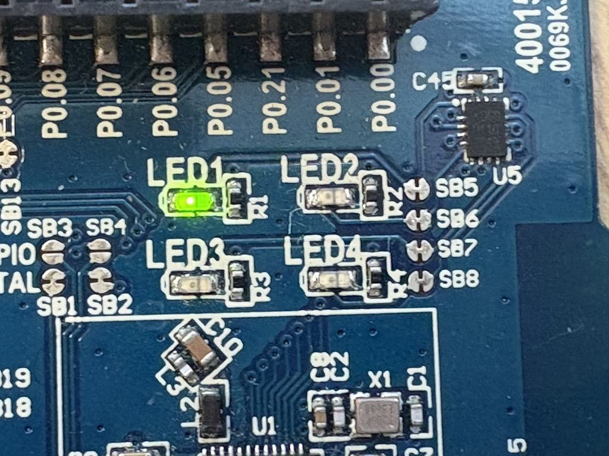
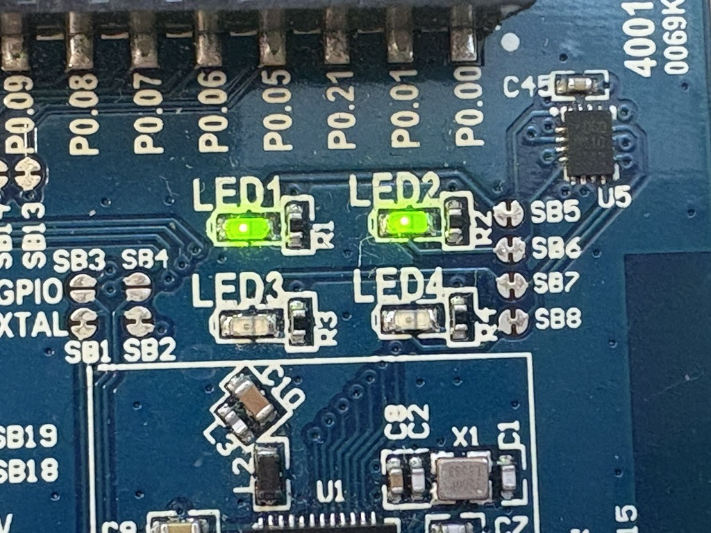
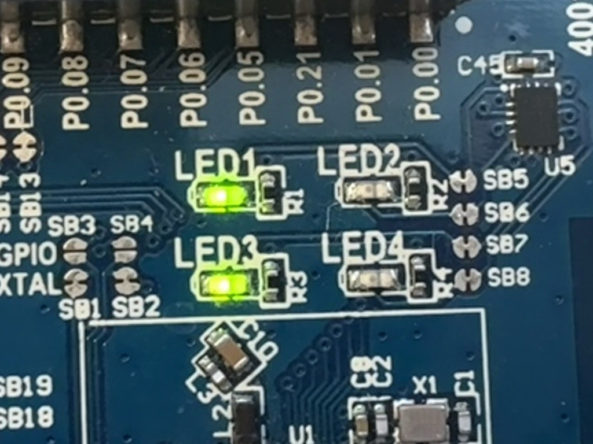
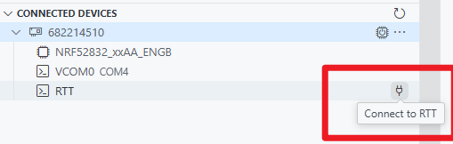
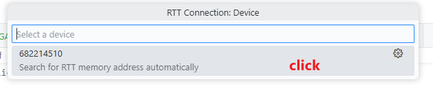
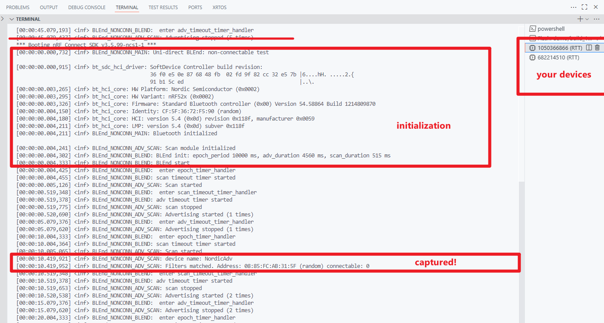

# Demo Notebook
## Introduction

This notebook provides a walkthrough of the example in the `demo` folder. These examples are designed to demonstrate how neighbor discovery works using BLE advertisements and scanning, with a particular focus on the BLEnd protocol.

For background information on BLE advertisement/scanning mechanisms and the BLEnd neighbor discovery protocol, please refer to the documentation [BLE Advertising and Scanning: What You Need to Know](..\docs\BLE_background_1.md).


## ⚙️ Demo Implementation
If you're unsure how to start and manage a timer, the document [How to Use a Timer](introduction_to_Ktimer.md) provides a quick start guide.

In the demo_1, our application's timing and BLE operations are precisely managed by three distinct timers, each serving a specific role: 

- `epoch_timer` defines the fixed duration of each epoch and controlling the repetition of these epochs. Crucially, this timer also initiates scanning at the beginning of every new epoch, ensuring the device periodically attempts to discover nearby nodes.  

- `scan_timeout_timer` determines the duration of each scan operation and, upon its expiration, triggers the transition from scanning to advertising mode.

- `adv_timeout_timer` controls the duration of our device's advertising periods.

### Initialization: Setting Up Timing Parameters
The timing parameters for the BLEnd application are configured during its initialization phase, specifically within the `blend_init()` function. This function takes the desired epoch length `E` and advertising interval `A` as inputs, from which the durations for scanning and advertising are derived.
- Scan Duration:
  
  Formula: Scan Duration = `A+s+b`

  - max_random_delay `s`: Represents the maximum random delay that might be applied to an advertising event.  `s` is assigned a fixed value of 10 milliseconds for the calculation since this random delay typically varies between 0 and 10 milliseconds.

  - beacon_duration `b`: Represents the typical duration of a single BLE beacon transmission. For this implementation, `b` is assigned a fixed value of 5 milliseconds.

- Advertising Duration:

  This is the crucial calculation that determines the overall length of the active part of the epoch (which includes both scanning and subsequent advertising). The goal is to ensure the last beacon transmission effectively finishes after the midpoint of the epoch (`E/2`).

  Logic:

  - First, we determine how many average advertising intervals (`A+5ms`) can fit within the portion of the first half-epoch remaining after accounting for an average random delay of 5ms.

  - We then add 1 to this count to ensure at least one "incomplete" interval is considered.

  - Multiply this advertising interval count" by `A+5ms` to get a base active duration.

  - Finally, we add 15ms (max_random_delay `s` + beacon_duration `b`) to this duration. This explicit addition ensures the end of the last beacon's transmission extends past the `E/2` mark.
    ```c
    static int epoch_period,adv_duration, scan_duration;
    /**
    * @brief Initializes the BLEnd module
    *
    * @param epoch_duration Duration of the epoch in milliseconds
    * @param adv_interval Advertising interval in 0.625 milliseconds
    */
    void blend_init(int epoch_duration, int adv_interval)
    {
        int adv_interval_count;
        epoch_period = epoch_duration;
          scan_duration = adv_interval* 0.625 +10 + 5;	//one adv_interval + 10ms random delay + 5ms for one advertising packet length
        adv_interval_count = (epoch_duration/2 - scan_duration)/(adv_interval* 0.625 +5);   //an average random delay of 5ms
        adv_interval_count+=1;    //one "incomplete" interval
          adv_duration =adv_interval_count*(adv_interval* 0.625 +5)+15 ; // 15 ms for the last beacon's transmission 
        LOG_INF("BLEnd init: epoch_period %d ms, adv_duration %d ms, scan_duration %d ms", epoch_period, adv_duration, scan_duration);
    }
    ```

### Workflow: Timer-Driven State Transitions  

The workflow unfolds as follows:  
- Application Start and Epoch Initialization:  

  Upon the BLEnd application's initiation, the `epoch_timer` is started. This timer is configured as a periodic timer with a cycle corresponding to the full epoch length (`E`). Crucially, its initial delay is set to `K_NO_WAIT`, which means the `epoch_timer_handler` is executed immediately after the epoch_timer is started.

  When the `epoch_timer_handler` is invoked (signaling the start of a new epoch):

    - It immediately submits `scan_work` to the system workqueue. This work item, executed in a thread context, is responsible for starting the BLE scanning process.

    - Concurrently, it starts the `scan_timeout_timer`. This is configured as a one-shot timer with an initial delay equal to the predefined scan duration.

- Scanning Timeout and Transition to Advertising:

  When the `scan_timeout_timer` expires (indicating the scan duration has passed), its handler is executed. 
  
  Within this handler:

    - It submits `scan_stop` to the workqueue to terminate the current scanning operation.

    - Immediately following, it submits `adv_work` to the workqueue, which then start the BLE advertising process.

    - Simultaneously, it starts the `adv_timeout_timer`. This is also a one-shot timer, whose initial delay is set to the intended advertising duration.

- Advertising Timeout and Return to Stand-by:

  Upon the `adv_timeout_timer`'s expiration (signaling the end of the advertising duration), its handler is executed. In this handler:

    - It performs the necessary actions to stop the BLE advertising.

  Typically, at this point, the radio enters a low-power stand-by state until the next active period.

- Workflow Repetition:

  Since the `epoch_timer` is a periodic timer, it will continue to expire and trigger its handler at the completion of each epoch length (`E`). This inherent periodicity ensures that the entire sequence — scanning, transitioning to advertising, and then returning to an idle state — repeats seamlessly for every subsequent epoch, maintaining the defined operational cycle of the BLEnd node.

### Advertising and Scanning Implementation   
The files `advertiser_scanner.c` and `advertiser_scanner.h` contain the key structures and functions used to implement advertising and scanning in this example. These components are responsible for configuring BLE roles, scheduling radio operations, and handling received advertisement packets.

The implementation makes use of official Zephyr Bluetooth APIs, particularly those defined under the GAP specification. To understand how these APIs are used and the associated parameter structures, please refer to [Introduction to GAP](..\docs\introduction_to_GAP.md).

#### Advertising   
- **Configuration:**    
    In this demo, we focus solely on the advertising and scanning phases of BLE operation, without establishing any connections. Therefore, when configuring the `bt_le_adv_param *adv_param` structure, we set the options field to `BT_LE_ADV_OPT_NONE`, which means "no options specified." As a result, the device performs non-connectable undirected advertising, effectively functioning as a beacon. This configuration allows other devices to scan and receive advertisements, but not initiate a connection.   
    ```c
        /* BLE Advertising Parameters variable */
    static struct bt_le_adv_param *adv_param =
        BT_LE_ADV_PARAM(BT_LE_ADV_OPT_NONE, /* No options specified */
                500, /* assign an initial value first */
                500, /* assign an initial value first */
                NULL); /* Set to NULL for undirected advertising */

    ```

- **Data:**   
    The advertisement payload includes three main components: the **Flags**, the **device name**, and the **Manufacturer Data**. The Manufacturer Data field is particularly important in this demo. It contains a standard Company Identifier Code, followed by a custom-defined BLEnd ID, which signals that the device is actively participating in the BLEnd neighbor discovery protocol. (This BLEnd ID is defined in the original repository uploaded by the authors of the BLEnd protocol.) This setup allows scanning devices to recognize BLEnd participants based on their advertisement content, without requiring any additional interaction or connection.

    ```c        
    /* Declare the Company identifier (Company ID) */
    #define COMPANY_ID_CODE 0x0059
    #define BLEND_IDENTIFIER  0xFE
    typedef struct adv_mfg_data {
        uint16_t company_code; /* Company Identifier Code. */
        uint16_t blend_id;
    } adv_mfg_data_type;


    /* Define and initialize a variable of type adv_mfg_data_type */
    static adv_mfg_data_type adv_mfg_data = { COMPANY_ID_CODE, BLEND_IDENTIFIER };

    /* Declare the advertising packet */
    static const struct bt_data ad[] = {
        /* Set the advertising flags */
        BT_DATA_BYTES(BT_DATA_FLAGS, BT_LE_AD_NO_BREDR), // no BR/EDR support
        /* Set the advertising packet data: device name and manufacturer data */
        BT_DATA(BT_DATA_NAME_COMPLETE, DEVICE_NAME, DEVICE_NAME_LEN), 
        BT_DATA(BT_DATA_MANUFACTURER_DATA, (unsigned char *)&adv_mfg_data, sizeof(adv_mfg_data)),   

    };
    ```
    The device name included in the advertisement packet is configured via the` prj.conf` file, using the `CONFIG_BT_DEVICE_NAME` option. In this demo, we used "NordicAdv" as the device name, but feel free to customize it to anything you like. 

    ```
    # Bluetooth LE
    # Include the Bluetooth LE stack in your project
    CONFIG_BT=y
    # Set the Bluetooth LE device name
    CONFIG_BT_DEVICE_NAME="NordicAdv"
    ```
#### Scanning    
- **Configuration:**   
    Since our advertisements are non-connectable and we do not use scan response data, the scanner is configured to operate in a non-intrusive, passive manner. Specifically, we disable automatic connection attempts and set the scan type to BT_SCAN_TYPE_SCAN_PASSIVE. This ensures that the scanner only listens for advertisements without sending scan requests or initiating connections, which aligns with the lightweight, broadcast-only nature of the BLEnd protocol.
- **Scan filter:**     
    Our scanner is capable of receiving a wide range of BLE advertisements from nearby devices. However, how can we tell which advertisement packets are actually relevant to our application? To address this, we apply a filter to the scanner, allowing it to identify and process only the packets we’re interested in. In this demo, the filter is used to detect advertisement packets that contain a specific Manufacturer Data pattern. This ensures that the scanner only responds to devices actively participating in the BLEnd protocol.   
    First, we enable the scanning module and filtering functionality through the `prj.conf` file. Specifically, we activate the scan filter feature and configure the type and number of filters to be used. In this demo, we define one Manufacturer Data filter, which allows the scanner to selectively process advertisement packets that contain a specific payload structure corresponding to the BLEnd protocol.

    ```
    # Enable the BLE Scan module: one maunfacturer data filter
    CONFIG_BT_SCAN=y
    CONFIG_BT_SCAN_FILTER_ENABLE=y
    CONFIG_BT_SCAN_MANUFACTURER_DATA_CNT=1
    ```

    During the initialization of the scan module, we add a scan filter and enable it using the Manufacturer Data filter mode. Specifically, we register the expected pattern (containing the Company Identifier Code and BLEnd ID) and activate the filter with the mode `BT_SCAN_MANUFACTURER_DATA_FILTER`. This ensures that only advertisement packets matching our defined Manufacturer Data format will trigger further processing.   

    - Expected pattern:     
        ```c
        /* Declare the Company identifier (Company ID) */
        #define COMPANY_ID_CODE 0x0059
        #define BLEND_IDENTIFIER  0xFE
        typedef struct adv_mfg_data {
            uint16_t company_code; /* Company Identifier Code. */
            uint16_t blend_id; /* sequence number */
        } adv_mfg_data_type;


        /* Define and initialize a variable of type adv_mfg_data_type */
        static adv_mfg_data_type adv_mfg_data = { COMPANY_ID_CODE, BLEND_IDENTIFIER };


        // Define the bt_scan_manufacturer_data struct for the filter
        // It holds a pointer to your filter data and its length
        static struct bt_scan_manufacturer_data mfg_filter = {
            .data = (uint8_t *)&adv_mfg_data,
            .data_len = sizeof(adv_mfg_data),
        };
        ```

    - void scan_init(void):   
        ```c
        int err;
        uint8_t filter_mode = 0;

        err = bt_scan_filter_add(BT_SCAN_FILTER_TYPE_MANUFACTURER_DATA,&mfg_filter );
        if (err) {
            LOG_ERR("filter cannot be added (err %d", err);
            return;
        }
        filter_mode |= BT_SCAN_MANUFACTURER_DATA_FILTER;

        err = bt_scan_filter_enable(filter_mode, false);
        if (err) {
            LOG_ERR("Filters cannot be turned on (err %d)", err);
            return;
        }
        ```
## Demo Results 📡
Before running this demo, make sure you have completed the necessary setup steps. We recommend starting with [Lesson 1, Exercise 1](https://academy.nordicsemi.com/courses/nrf-connect-sdk-fundamentals/lessons/lesson-1-nrf-connect-sdk-introduction/topic/exercise-1-1/) of the official nRF Connect SDK Fundamentals tutorial provided by Nordic Semiconductor. This exercise walks you through installing the required development tools, setting up your environment.

We also recommend completing [Exercise 2](https://academy.nordicsemi.com/courses/nrf-connect-sdk-fundamentals/lessons/lesson-1-nrf-connect-sdk-introduction/topic/exercise-2-1/) of the same lesson. It provides a hands-on introduction to building and flashing applications to your development board using the nRF Connect SDK and associated tools. This step is especially helpful if you're new to Nordic's development workflow, as it familiarizes you with the process of compiling firmware and programming the device.  
### Build and Flash

In the Build Configuration page, select the appropriate board target based on the BLE hardware you are using. In our case, we use the **nrf52832dk** development kit. For the configuration, choose the `prj.conf` file as the active configuration. No additional settings are required. Once this is done, simply click `Generate and Build` to compile the application.  

Once the build completes successfully, you should see a message similar to the one shown in the screenshot below in the terminal.

  

After that, connect your development board to the computer via USB. The **nRF Connect for VS Code** should automatically detect the connected device. Simply click **Flash** to program the board with the generated build files.




### Observed Results from the Demo
There are two main ways to observe the behavior of the running demo: LED indicators and the RTT terminal output.

We assign LED1, LED2 and LED3 to indicate BLEnd running, scanning and advertising activity, respectively. When the device is actively advertising or scanning, the corresponding LED will turn on, providing a simple visual confirmation of the current state.

In addition, the demo uses the Logger module, which prints messages to the terminal via RTT (Real-Time Terminal). This output provides more detailed runtime information, such as advertising/scanning events and received packets, making it easier to debug and understand the protocol flow.

#### LED indicators   
The blinking LED1 indicate that the device is actively running the BLEnd protocol. 



At the beginning of each epoch, the device first enters the scanning phase, during which LED2 is turned on. This indicates that the device is actively listening for nearby BLE advertisements as part of the BLEnd neighbor discovery process.



After the scanning phase completes, the device transitions into the advertising phase. At this point, LED2 turns off and LED3 turns on, signaling that the device is now broadcasting its own BLE advertisement to announce its presence to nearby nodes.



After the advertising phase ends, there is a short idle period that lasts for approximately half of the epoch. During this time, only LED1 blinks, while both LED2 and LED3 remain off. This indicates that the device is still running the BLEnd protocol, but is not performing any active radio operations (i.e., neither scanning nor advertising). 

#### RTT terminal
After flashing the board, connect to the device’s RTT interface to monitor log output. 




Once connected, you will see log messages printed in the RTT terminal, providing real-time feedback from the application. These messages include status updates for advertising and scanning, filtered packet detection, and other useful debug information.

