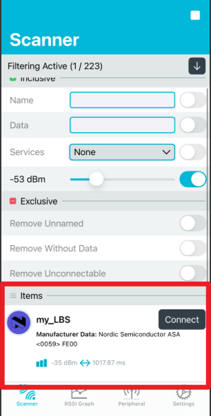
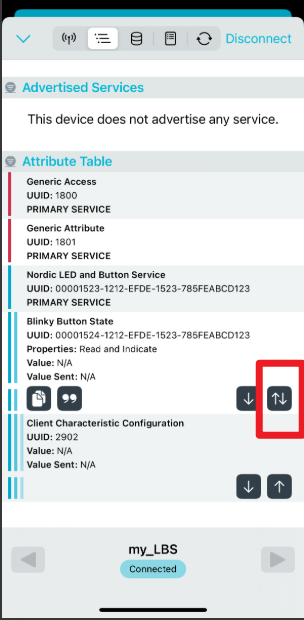
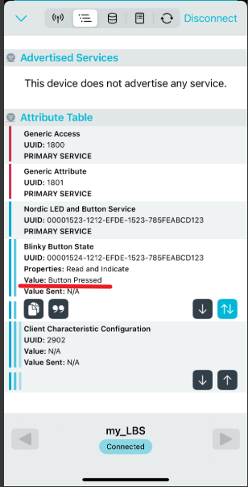
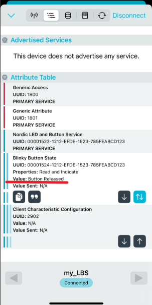
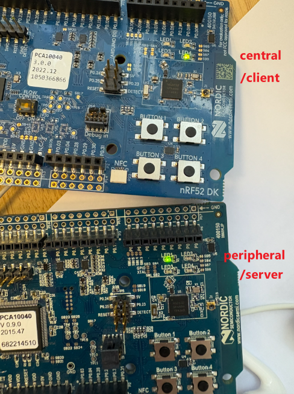
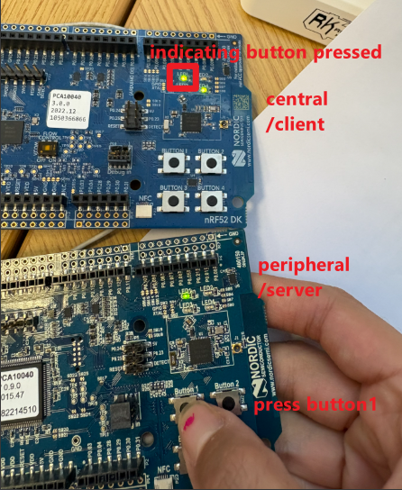
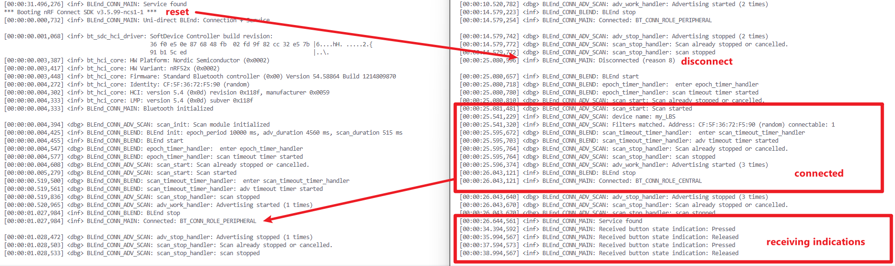

# Demo-Connect Notebook
## Introduction   
In the previous example from the `demo` folder, you learned how to configure advertising and scanning to enable device discovery using BLE. In this example, we take it a step further: once devices discover each other, they proceed to establish a connection and demonstrate basic data exchange through a custom service.

Unlike the previous demo, this example is presented as a challenge, requiring some self-guided learning. To prepare, we highly recommend reading [Lesson 4](https://academy.nordicsemi.com/courses/bluetooth-low-energy-fundamentals/lessons/lesson-4-bluetooth-le-data-exchange/) from the Nordic Bluetooth Low Energy Fundamentals course. It provides essential background on how GATT (Generic Attribute Profile) services and characteristics are used to structure and transfer data in a BLE connection.

## LED Button Service (LBS)

While Lesson 4, Exercises 1 and 2 in the Nordic tutorial provide a detailed walkthrough of configuring an LBS server, including characteristic read/write operations and sending indications, their example focuses on interaction between a BLE device (as the server) and a mobile app (as the client).

In contrast, this `demo_connect` is designed to demonstrate device-to-device communication, where both the **client** and **server** are embedded BLE devices. To simplify the setup, the server only provides a basic Button Characteristic, and the emphasis is placed on client-side configuration, including service discovery, characteristic subscription, and handling received indications.

The goal is to show how two BLE-enabled devices can autonomously discover each other, establish a connection, and exchange data using GATT, without relying on external apps or user interaction via smartphones.

In this setup:

- The server provides a Button Characteristic, which reflects the state of a physical button on the device.

- The client first performs GATT service discovery to locate the LBS on the server. Once the service is found, the client subscribes to the Button Characteristic.

- From that point on, whenever the server detects a change in the button state, it sends an indication to the client. 

- This allows the client to receive real-time updates whenever the server’s button is pressed or released, illustrating how BLE GATT indications can be used for efficient event-driven communication.

Due to the higher memory requirements of the **central** role, please make sure to use two BLE development boards that support **central** functionality.

Build and flash the `demo_connect` application onto both devices. Once running, each device will first execute the BLEnd protocol to discover nearby peers through advertising and scanning. After discovery, one device will initiate a connection to the other and proceed with GATT-based service interaction, completing the full discovery-and-connect flow.

### Configuration
In the `prj.conf` file, we enable the required Bluetooth GAP roles and also limit the device to a single active connection at a time, which simplifies connection management.

```
# enable BLE GAP roles
CONFIG_BT_PERIPHERAL=y
CONFIG_BT_CENTRAL=y
CONFIG_BT_MAX_CONN=1
```
Since the central device will perform GATT service discovery and handle characteristics, we enable `CONFIG_BT_GATT_CLIENT` and `CONFIG_BT_GATT_DM` to support the client role and allow dynamic discovery of services on the peer device. Because GATT discovery and central operations require more memory, we also set `CONFIG_HEAP_MEM_POOL_SIZE=2048` to ensure the application has sufficient dynamic memory during runtime.

```
CONFIG_BT_GATT_CLIENT=y
CONFIG_BT_GATT_DM=y
CONFIG_HEAP_MEM_POOL_SIZE=2048
```

### LED indicators 

As in the previous demo, LED2 and LED3 are used to indicate the scanning and advertising phases, respectively. In this example, we also utilize **LED1** and **LED4** to indicate the device’s role after a connection is established:

**LED1** turns on if the device is acting as a **peripheral**.

**LED4** turns on if the device is acting as a **central**.

In the BLE GATT service, the peripheral functions as the **server**, while the central acts as the **client**.

For the **central/client** device, **LED1** serves an additional purpose: it reflects the button state received from the server via indications. When a "button pressed" indication is received, LED1 turns on. When a "button released" message is received, LED1 turns off. This provides real-time, visible feedback that the central device is successfully receiving and interpreting the server's characteristic updates.

## Server

The files `my_lbs.c` and `my_lbs.h` contain the code for the LBS server, adapted from Lesson 4, Exercises 1 and 2 in the Nordic tutorial. Since the implementation closely follows the original example, we won’t go into detail here.

As a quick test, you can build and flash the server code onto a development board and interact with it using a mobile app (e.g., nRF Connect for Mobile). This allows you to verify that the Button Characteristic is functioning correctly before proceeding with full device-to-device interaction.

To demonstrate the server functionality, you can use the nRF Connect for Mobile app as the client.   

- Scan for nearby BLE devices in the app. Look for the device named `my_LBS`. Once found, connect to the device.    
      

- The app will automatically discover the services provided by the server. Locate the Button Characteristic, and tap the button outlined in red to subscribe to indications.  

    

- Now, when you press the physical button (Button 1) on the development board, the server sends a Button State indication, which is received and displayed by the mobile app. 

    
    

## Client

From the interaction between the server and the mobile app, we can clearly see the key responsibilities of a central device in this context:

1. Scan for the target peripheral device and initiate a connection once the device is discovered.

2. Perform service discovery to locate the desired GATT service and characteristics.

3. Subscribe to indications from the Button State characteristic to receive updates.

These same steps will be implemented in the client-side firmware when setting up communication between two development boards.

### Initiate a connection

- **Advertiser:**
    First, we configure the device to broadcast **connectable** advertisements instead of non-connectable beacons, allowing other devices to initiate a connection once discovered.   

    in `demo_connect/src/advertiser_scanner.c`   
    ```c
        /* BLE Advertising Parameters variable */
        static struct bt_le_adv_param *adv_param =
            BT_LE_ADV_PARAM(BT_LE_ADV_OPT_CONNECTABLE, /* connectable */
                    500, /* assign an initial value first */
                    500, /* assign an initial value first */
                    NULL); /* Set to NULL for undirected advertising */
    ```
- **Scanner:**
    On the scanning side, we continue to use a Manufacturer Data filter within the scan module. When a device detects an advertisement that matches this filter, it immediately initiates a connection to the advertising peer. This enables automatic pairing between BLEnd-enabled devices without user interaction.   

    in `demo_connect/src/advertiser_scanner.c`       
    ```c
        struct bt_scan_init_param scan_init = {
        .scan_param = &my_scan_param,
        .connect_if_match = true,
        };
    ```
- **Connection:**    
    The functions and structures used for connection management are detailed in the documentation [Introduction to GAP](../docs/introduction_to_GAP.md).   

    In `main.c`, we declare a static pointer to hold the active connection. This variable is used throughout the application to track the current BLE connection and interact with the connected peer. We also register connection callbacks using a `bt_conn_cb` structure. These callbacks handle key connection events such as connection established, disconnected. Registering these callbacks allows the application to respond to connection state changes appropriately.

    ```c
       static struct bt_conn *default_conn = NULL;
       struct bt_conn_cb connection_callbacks = {
            .connected = on_connected,
	        .disconnected = on_disconnected,
        };
        int main(void){
            ...
            // Register the connection callbacks 
	        bt_conn_cb_register(&connection_callbacks);
            ...
        }
    ```
    Next, we implement the connection and disconnection callback functions to manage the BLE connection lifecycle.

    - Inside the **connection** callback function, we first stop the BLEnd protocol because `CONFIG_BT_MAX_CONN` is set to 1 in the `prj.conf` file. Then, we increase the reference count to safely keep track of the active connection, followed by retrieving detailed connection information. The `info.role` field indicates whether the device is currently acting as a central or peripheral. Based on this role, we turn on the corresponding LED to visually indicate the device’s role after the connection is established.
        ```c
        #define CONN_LED_PERIPHERAL DK_LED1
        #define CONN_LED_CENTRAL DK_LED4
        static void on_connected(struct bt_conn *conn, uint8_t err)
        {
            int err_dm;
            struct bt_conn_info info = {0};
            /*  check errors ... */

            blend_stop();

            default_conn = bt_conn_ref(conn);
            err_dm = bt_conn_get_info(default_conn, &info);
            if (err_dm) {
                LOG_ERR("Failed to get connection info %d\n", err);
                return;
            }
            if (info.role == BT_CONN_ROLE_PERIPHERAL) {
                    LOG_INF("Connected: BT_CONN_ROLE_PERIPHERAL\n");
                dk_set_led_on(CONN_LED_PERIPHERAL);
            }
            if (info.role == BT_CONN_ROLE_CENTRAL) {
                LOG_INF("Connected: BT_CONN_ROLE_CENTRAL\n");
                dk_set_led_on(CONN_LED_CENTRAL);
                /*  service discovery (next step) ... */
            }      
        }
        ```
    - In the **disconnect** callback function, we log the reason for disconnection, unreference the connection object and set `default_conn` back to `NULL` since there is no active connection anymore. After that, we restart the BLEnd protocol to resume neighbor discovery following the disconnection.
        ```c
        static void on_disconnected(struct bt_conn *conn, uint8_t reason)
        {
            LOG_INF("Disconnected (reason %u)\n", reason);

            dk_set_led_off( CONN_LED_CENTRAL);
            dk_set_led_off(CONN_LED_PERIPHERAL);

            bt_conn_unref(default_conn);
            default_conn = NULL;

            blend_start();
        }
        ```
###  Service Discovery

We first define a discovery callback structure: `struct bt_gatt_dm_cb discovery_cb`. This structure contains three callback functions that will be triggered during the GATT discovery process: one when the target service is found, one when the service is not found, and one for handling errors. In these callbacks, we simply log the service discovery states: "Service found", "Service not found", or "Error while discovering GATT database" along with the corresponding error code.
```c
static void discovery_complete(struct bt_gatt_dm *dm,
			       void *context)
{
	
	int err;
	LOG_INF("Service found");
}

static void discovery_service_not_found(struct bt_conn *conn,
					void *context)
{
	LOG_INF("Service not found\n");
}

static void discovery_error(struct bt_conn *conn,
			    int err,
			    void *context)
{
	LOG_ERR("Error while discovering GATT database: (%d)\n", err);
}

struct bt_gatt_dm_cb discovery_cb = {
	.completed         = discovery_complete,
	.service_not_found = discovery_service_not_found,
	.error_found       = discovery_error,
};
```

In the `on_connect` callback, the central device initiates GATT service discovery using:
```c
static void on_connected(struct bt_conn *conn, uint8_t err){
    int err_dm;
    /* ... */
    if (info.role == BT_CONN_ROLE_CENTRAL) {
                LOG_INF("Connected: BT_CONN_ROLE_CENTRAL\n");
                dk_set_led_on(CONN_LED_CENTRAL);
                /*  service discovery  */
                err_dm = bt_gatt_dm_start(default_conn,
                          BT_UUID_LBS,
                          &discovery_cb,
                          NULL);
            }       
}
```
This function starts the discovery process for the LBS on the connected peripheral device. The parameters passed are:

- `default_conn`: the active connection to the peer device,

- `BT_UUID_LBS`: the UUID of the service to discover,

- `discovery_cb`: a struct containing callback functions to be triggered during discovery,

- `NULL`: a user-defined context to be passed to callback functions. Set to `NULL` here.

### Discovery Complete

After the GATT service discovery completes, we proceed to assign the discovered handles to our client structure and subscribe to the Button Characteristic indications. Finally, we release the discovery manager’s resources using `bt_gatt_dm_data_release` to free memory allocated during the discovery process.
```c
static void discovery_complete(struct bt_gatt_dm *dm,
			       void *context)
{
	
	int err;
	LOG_INF("Service found");

	my_lbs_client_handles_assign(dm, &bt_my_client);

	err = my_lbs_client_button_subscribe(&bt_my_client, my_lbs_indicate_cb);
	if (err) {
		printk("Could not subscribe to LBS button characteristic (err %d)\n",
		       err);
	}

	err = bt_gatt_dm_data_release(dm);
	if (err) {
		LOG_ERR("Could not release the discovery data (err %d)\n", err);
	}
}
```

The client-related functions and structures are defined in the `my_lbs_client.c` and `my_lbs_client.h` files.

- **Assign the discovered handles:**   
    The function `my_lbs_client_handles_assign` is responsible for extracting and storing relevant GATT handles (such as the characteristic value handle and CCCD handle) from a discovered LBS, using the GATT Discovery Manager (`bt_gatt_dm`). It maps these handles into the local `my_lbs_client` structure so the client can interact with the LBS (e.g., subscribe to button state changes).
    **Parameters:**    
    - `my_lbs_client`: This structure is defined in `my_lbs_client.h`, which holds necessary state and data for interacting with a remote LBS on a BLE peripheral. It is used by the LBS client application to store the BLE connection, characteristic handles, and internal state for subscribing to button state indications.

    - `dm`: This pointer is a reference to a GATT Discovery Manager `bt_gatt_dm` instance, which contains the results of a completed service discovery procedure on a connected BLE peripheral.

    In `my_lbs_client.h`   
    ```c
        struct my_lbs_client_button {
            /** Value handle. */
            uint16_t handle;

            /** Handle of the characteristic CCC descriptor. */
            uint16_t ccc_handle;

            /** GATT subscribe parameters for indicate. */
            struct bt_gatt_subscribe_params indicate_params;

            /** Indicate callback. */
            my_lbs_client_indicate_cb indicate_cb;
        };

        struct my_lbs_client {
            /** Connection object. */
            struct bt_conn *conn;

            /** LBS button characteristic. */
            struct my_lbs_client_button button_char;

            /** Internal state. */
            atomic_t state;
        };

    ```

    In `my_lbs_client.c`   
    ```c
    int my_lbs_client_handles_assign(struct bt_gatt_dm *dm, struct my_lbs_client *my_lbs_c)
    {
        // Get the primary service attribute and value
        const struct bt_gatt_dm_attr *gatt_service_attr = bt_gatt_dm_service_get(dm);
        const struct bt_gatt_service_val *gatt_service = bt_gatt_dm_attr_service_val(gatt_service_attr);

        // Declare variables for characteristic and descriptor attributes
        const struct bt_gatt_dm_attr *gatt_chrc;
        const struct bt_gatt_dm_attr *gatt_desc;

        // Check for null pointers
        if (!dm || !my_lbs_c) {
            return -EINVAL;
        }

        // Verify that the discovered service is the expected LBS
        if (bt_uuid_cmp(gatt_service->uuid, BT_UUID_LBS)) {
            return -ENOTSUP;  // Service not supported
        }

        LOG_DBG("Getting handles from my_lbs service.");

        // Reinitialize the client structure to clear any previous state
        my_lbs_reinit(my_lbs_c);

        // Find the LBS-BUTTON characteristic by UUID
        gatt_chrc = bt_gatt_dm_char_by_uuid(dm, BT_UUID_LBS_BUTTON);
        if (!gatt_chrc) {
            LOG_ERR("No LBS characteristic found.");
            return -EINVAL;
        }

        // Find the characteristic value descriptor (i.e., the actual value handle)
        gatt_desc = bt_gatt_dm_desc_by_uuid(dm, gatt_chrc, BT_UUID_LBS_BUTTON);
        if (!gatt_desc) {
            LOG_ERR("No LBS-BUTTON characteristic value found.");
            return -EINVAL;
        }

        // Store the value handle in the client structure
        my_lbs_c->button_char.handle = gatt_desc->handle;

        // Find the CCCD (Client Characteristic Configuration Descriptor)
        gatt_desc = bt_gatt_dm_desc_by_uuid(dm, gatt_chrc, BT_UUID_GATT_CCC);
        if (!gatt_desc) {
            LOG_ERR("No LBS-BUTTON CCC descriptor found.");
            return -EINVAL;
        }

        // Store the CCC handle in the client structure
        my_lbs_c->button_char.ccc_handle = gatt_desc->handle;

        LOG_DBG("LBS-BUTTON characteristic found");

        // Store the BLE connection reference for future operations
        my_lbs_c->conn = bt_gatt_dm_conn_get(dm);

        return 0;  // Success
    }

    ```

- **Subscribe to the Button Characteristic:**    
    The purpose of the function `my_lbs_client_button_subscribe` is to allow the client device to subscribe to indication messages from a remote BLE peripheral, so it can be indicated when the button state changes.
   
    The function first validates the input client structure and callback, then uses `atomic_test_and_set_bit` to check whether indication has already been enabled (`INDICATE_ENABLED`).

    It then sets the subscription parameters, including `ccc_handle`, `value_handle`, `value` (set to `BT_GATT_CCC_INDICATE`), and the `notify` callback. It also sets the `BT_GATT_SUBSCRIBE_FLAG_VOLATILE` flag to ensure the subscription is re-established after disconnection.
    
    Finally, it calls `bt_gatt_subscribe` to subscribe to the indication and returns the result.   
 
    **Parameters:**    
    - `my_lbs_c`: A pointer to the LBS client structure, which holds connection and characteristic information.    
    - `dicate_cb`: A user-provided callback function that will be invoked when an indication is received from the button characteristic.    
   
    ```c
    int my_lbs_client_button_subscribe(struct  my_lbs_client *my_lbs_c,
                        my_lbs_client_indicate_cb indicate_cb)
    {
        int err;

        // Create a local pointer alias to simplify access to the indication parameters
        struct bt_gatt_subscribe_params *params = &my_lbs_c->button_char.indicate_params;

        if (!my_lbs_c || !indicate_cb) {
            return -EINVAL;
        }

        if (atomic_test_and_set_bit(&my_lbs_c->state, INDICATE_ENABLED)) {
            LOG_INF("LBS-BUTTON characterisic indication already enabled.");
            // return -EALREADY;
        }

        // Set the required GATT subscription parameters
        my_lbs_c->button_char.indicate_cb = indicate_cb;
        params->ccc_handle = my_lbs_c->button_char.ccc_handle;
        params->value_handle = my_lbs_c->button_char.handle;
        params->value= BT_GATT_CCC_INDICATE;
        params->notify = my_lbs_button_indicate;

        atomic_set_bit(params->flags, BT_GATT_SUBSCRIBE_FLAG_VOLATILE);

        //subscribe to the characteristic
        err = bt_gatt_subscribe(my_lbs_c->conn, params);
        if (err) {
            atomic_clear_bit(&my_lbs_c->state, INDICATE_ENABLED);
            LOG_ERR("Subscribe to characteristic failed");
        } else {
            LOG_DBG("Subscribed to  LBS-BUTTON characteristic");
        }

        return err;
    }
    ```   

    


## Demo Results 📡
Now, build and flash the `demo_connect` application onto both boards. After a short time, BLEnd will connect the two devices automatically. The peripheral device will turn on LED1, while the central device will turn on LED4 to indicate their respective roles.   



When you press **Button 1** on the **peripheral** board, LED1 on the central board will turn on. Releasing Button 1 on the peripheral will turn LED1 off on the central, reflecting the button state change via BLE indications.   



We can also open the RTT (Real-Time Terminal) on both devices to observe more detailed logs. For example, if we reset one device, the other will log the disconnection reason 8 (The supervision timeout has expired). Then, both devices automatically start the BLEnd protocol. Once a neighbor is discovered, the scanner initiates a connection, performs service discovery, and starts receiving indications after the connection is established.  

